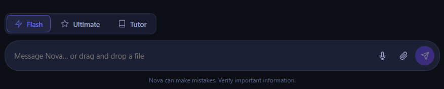
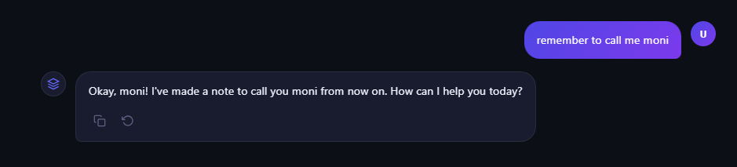
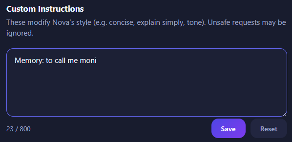
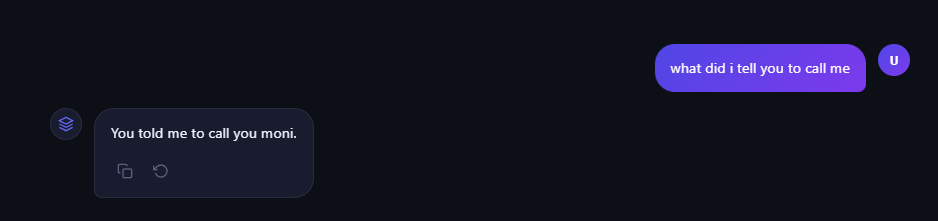
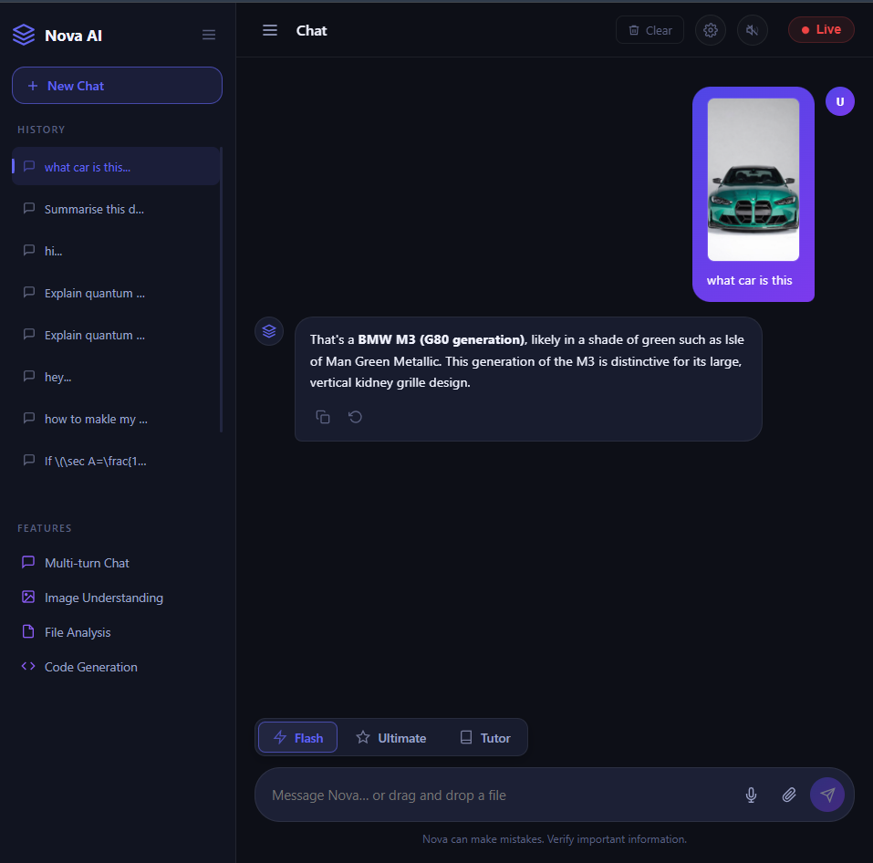
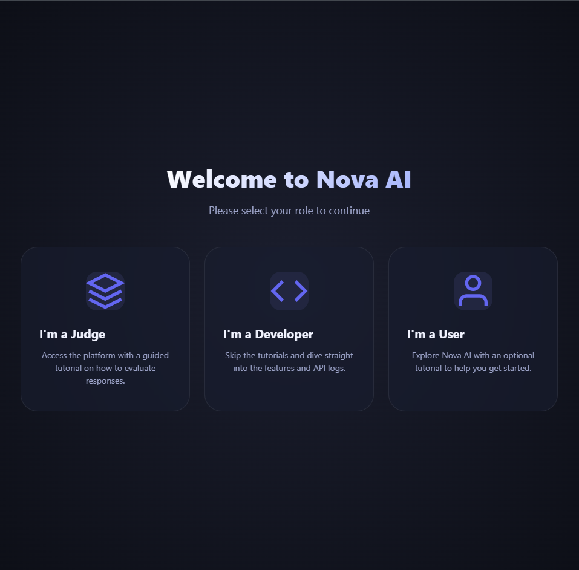
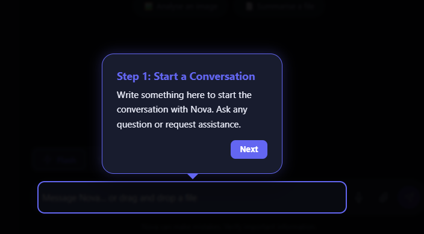
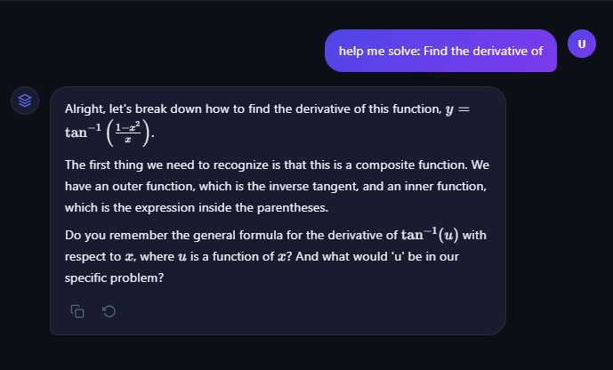

🌌 Nova AI: High-Performance Multimodal Assistant
Built for the Gemini API Developer Competition 2026;

Nova AI built by Sonip of Haldia,West Bengal,India.
Nova AI is a low latency,multimodal AI ,powered by Gemini 2.0/2.5/3.0/2.5-flash-native-audio-latest.IT bridges the gap between reality and the reasoning power of Gemini.It's main focus is speed,precision,user-interactivity.

🚀 Key Features
Text answers for speed: Uses the Gemini 2.5/3.0 flash to power the beginning of every ideas that shine.
Toggles between Flash and Ultimate: Flash powered by 2.0 flash focuses on speed over reasoning and ultimate powered by 3.0 flash provides reasoning and thinking over speed.
User based memory:A unique "Remember" keyword system that updates the model's core identity and user preferences in real-time.

Visual Intelligence: Ability to process images and screenshots to drive context-aware conversations.
Interactive tutorials: An interactive tutorial for people who are new to AI,
Multimodal integration:An interactive way of communication where it speaks,sees,hear and understands.
Tutor mode:A innovative mode for students to simplify their studies.Uses Katex for better understanding of math.

🛠️ Technical Stack
Models: Gemini 2.0/2.5/3.0 Flash (via Google GenAI SDK)

Backend: Node.js with Express & WebSockets (ws)

Frontend: Vanilla JavaScript, Tailwind CSS 4.0, and Marked.js

Containerization: Docker (Production-ready)

☁️ Google Cloud Deployment & Scalability
Nova is architected as a Cloud-Native application.

Google Cloud Run: The project includes a production-ready Dockerfile and is optimized for deployment on Google Cloud Run. It is configured to handle WebSocket session affinity required for the Live API.

Containerization: Full Docker support ensures that the environment is consistent from local development to GCP production.

Important Note:Student Developer Note: Due to student-tier sandbox billing constraints on Google Cloud Platform, the active live demo is currently served via an edge-node (Render). However, the architecture is fully containerized and verified for immediate migration to Google Cloud Run upon enterprise billing attachment.

Nova is built as a Cloud-Native container (see Dockerfile). While the demo environment is currently hosted on an edge-provider to ensure 24/7 availability for judges during the evaluation window without student-tier sandbox interruptions, the backend is fully optimized for Google Cloud Run. The core logic uses the Google Gemini Live API, fulfilling the Google technology requirement at the engine level.

📦 Installation & Setup
Clone the repository:

Bash
git clone https://github.com/sonip362/nova-powered-by-gemini.git
cd nova
Install dependencies:

Bash
npm install
Configure Environment:
Create a .env file and add your Google API Key:

Code snippet
GOOGLE_API_KEY=(There is a settings icon in the header click this to enter your paid/billed api key for better features.)
PORT=3000
Run the server:

Bash
npm start